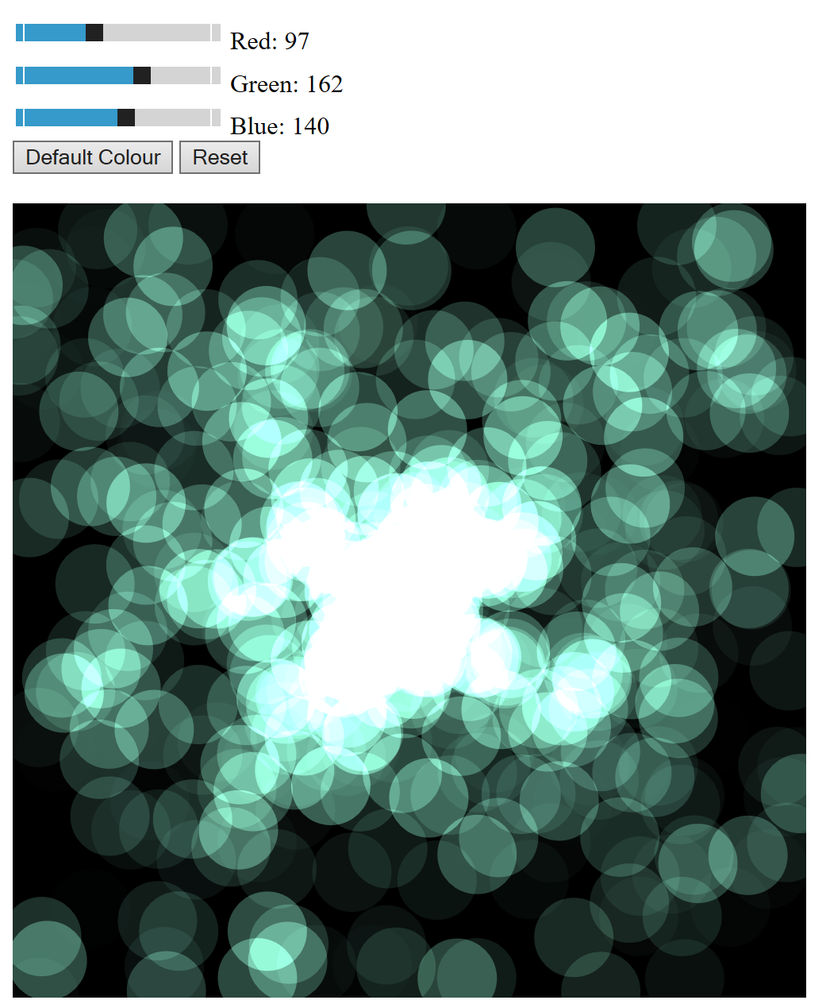

# Particles()
Usage:
```javascript
Particles(width, height, noParticles, graphic, red, green, blue)
```
## Description
A class to generate a graphical particle effect which can be rendered either on a 2D canvas or a 3D cube*. This class within it another class, Particle, used to generate each of the individual particles. The red, green and blue arguments in the Particles class are passed directly through to the Particle class, allowing the colour to be set when calling Particle.

_\*Due to absence of the blendMode() function in WEBGL rendering, the effect has a slightly different appearance when rendered in WEBGL._
## Parameters and Methods
### Parameters

* #### width:*
  The width of the created canvas

* #### height:*
  The height of the created canvas

* #### noParticles:*
  The maximum number of particles generated at any one time

* #### graphic:*
  Determines how to render the Particles component; a value of *true* will render on rotating 3D cube, *false* or no input for this argument will render on 2D canvas

* #### particles:
  Object array containing all instances of the Particle class

* #### red:
  R value for RGB particle colour

* #### green:
  G value for RGB particle colour

* #### blue:
  G value for RGB particle colour

_\*Can be given as arguments when calling the class:_
### Methods

* #### constructor()
  constructor method to create and initialise objects created from class - defines all parameters listed above
* #### init()
  Generates canvas (or graphic)

* #### draw()
  text

## Example
Below (and included in this repository) is an example of a usage of the class. For this, the class has been adapted to accept the RGB values directly from the html sliders allowing for dynamic changes.





## Original Code
The original code for this pieces can be found at: https://www.openprocessing.org/sketch/633781#
<br/>See LICENSE.md for license information.
